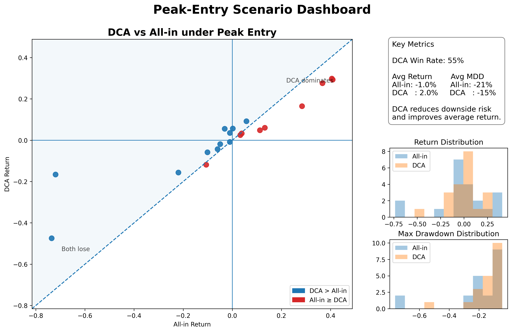
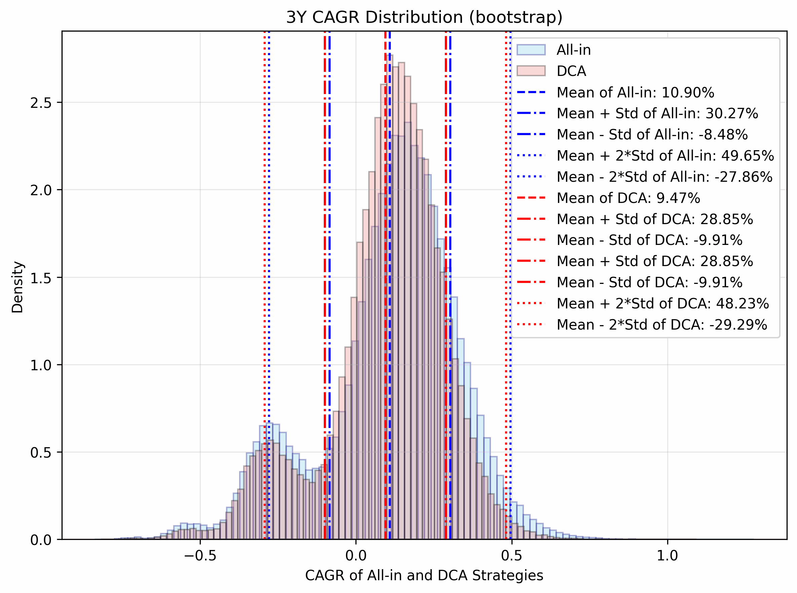
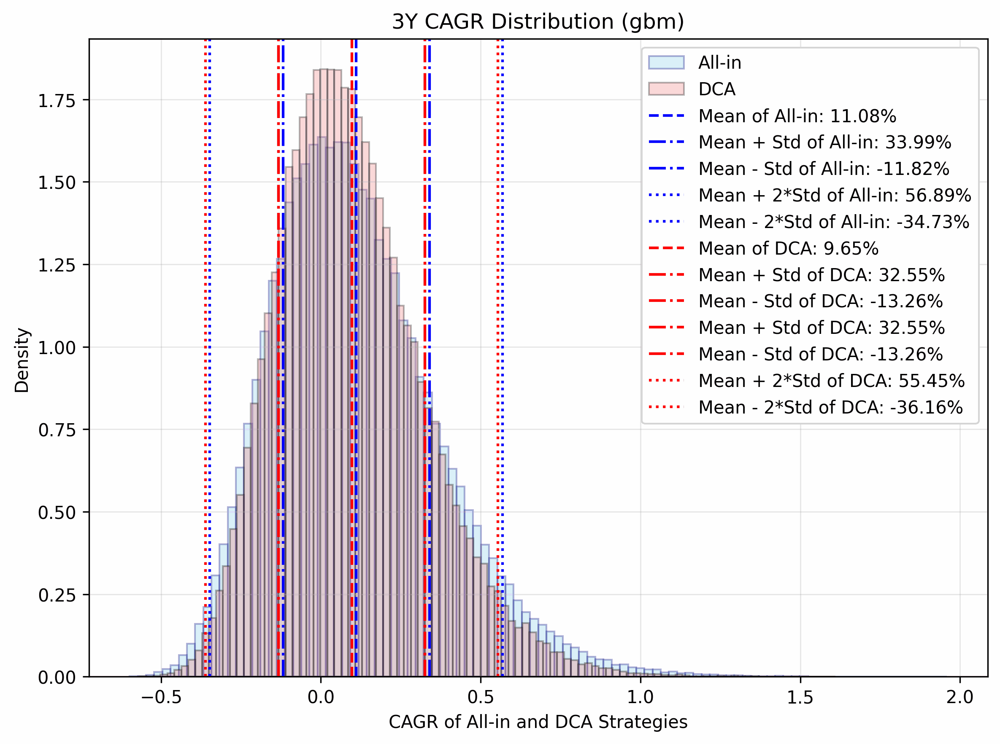

# 📈 All-in vs DCA: When Does Timing Matter?
A decision-oriented investment analysis project comparing lump-sum investing and dollar-cost averaging under timing uncertainty.


## 📄 Project Deliverables

- [One-page Summary (PDF)](docs/one_page_en.pdf)
- [Slides (PDF)](docs/slides_tc.pdf)
- [Slides (PowerPoint)](docs/slides_tc.pptx)


## 🎯 Problem

Investors often face a key decision:

- Invest all capital at once (All-in)
- Or spread investment over time (DCA)

**Which strategy performs better under uncertainty?**

This project evaluates the trade-off between:

- return maximization
- downside risk
- entry timing uncertainty

---

## ⚙️ Approach

We analyze the problem using four methods:

1. **Historical Backtest**  
   Compare yearly performance (2009–2025)

2. **Peak Entry Scenario**  
   Analyze outcomes when investing near market highs

3. **Monte Carlo Simulation (GBM & Bootstrap)**  
   Simulate long-term outcomes (3–30 years)

4. **Conditional Analysis Near High**  
   Study strategy performance under unfavorable entry timing

---

## 📊  Key Results

### 1. All-in vs DCA (Overall Market)
- All-in → higher expected return
- DCA → lower downside risk
- Near market highs, DCA becomes more competitive
- Initial entry timing materially affects long-term outcomes

---

### 2. Peak Entry Scenario (Near Market Highs)

<p align="center">
  
</p>


- DCA outperforms in ~55% of cases
- DCA reduces drawdown and tail risk
- In some cases, DCA turns losses into gains

#### Quadrant Plot
- Q1: Both positive → All-in tends to outperform  
- Q2: DCA positive, All-in negative → DCA avoids losses  
- Q3: Both negative → DCA reduces losses  
- Q4: No observed case where All-in outperforms while DCA loses  

---


### 🎬 3. Monte Carlo  Comparison: GBM vs Bootstrap 
Simulated 100,000 return paths using two approaches:

<!-- <p align="center">
  <b>Bootstrap (Historical Resampling)</b> &nbsp;&nbsp;&nbsp;&nbsp;&nbsp;&nbsp;
  <b>GBM (Parametric Simulation)</b>
</p>

<p align="center">
  
  
</p> -->

<table>
  <tr>
    <th align="center">GBM (Parametric Simulation)</th>
    <th align="center">Bootstrap (Historical Resampling)</th>
  </tr>
  <tr>
    <td align="center">
      
    </td>
    <td align="center">
      
    </td>
  </tr>
</table>


- GBM assumes normally distributed returns  
- Bootstrap captures empirical market behavior  


**Key observations:**
- All-in wins ~65% of simulations  
- Short horizon (<10 years):  
  - DCA achieves comparable or slightly higher average returns  
  - All-in exhibits higher risk  
- Long horizon (≥10 years):  
  - Differences diminish, but structural patterns remain


---

### 4. 🧠 Key Insight

> Initial entry timing dominates long-term outcomes

Even over 30 years, relative performance is largely determined at entry.

---

## Interpretation

- All-in maximizes expected return
- DCA mitigates timing risk and reduces extreme losses

👉 Trade-off: **Return vs Timing Risk**

---

## Conclusion

- Use **All-in** when:
  - expected return is positive
  - timing risk is low

- Use **DCA** when:
  - entering near market highs
  - timing is uncertain

---


## 📓 Exploratory Analysis

For full analysis and detailed simulations, see the notebook:

- [Full Analysis Notebook](notebooks/results.ipynb)


This notebook includes:
- Data processing
- Backtesting implementation
- Monte Carlo simulation (GBM & Bootstrap)
- Visualization and result interpretation

The notebook serves as a transparent and reproducible implementation of the analysis.


---


## Repository Structure
- `docs/`: final deliverables and visualization assets
- `notebooks/`: analysis notebook and exports
- `src/`: modularized analysis and backtest code
- `scripts/`: utility scripts such as GIF generation
- `main.py`: project entry point


--- 

## Practical Use
This framework helps evaluate how to deploy capital under uncertain market conditions, especially when entry timing is unfavorable.

---

## ⚠️ Limitations

- GBM assumes normally distributed returns
- Bootstrap assumes historical resampling is informative
- Transaction costs and taxes are excluded
- Regime shifts are not explicitly modeled


---

## Future Work

- Regime-switching models  
- Multi-asset portfolios  
- Real-world constraints (costs, taxes)

---


## ⚙️ Environment Setup 
Minimal dependencies are intentionally specified for reproducibility.

```sh
pip install -r requirements.txt
```

## 🛠 Visualization Pipeline
GIF animations are generated using a custom script:

```sh
python scripts/make_gif.py
```


